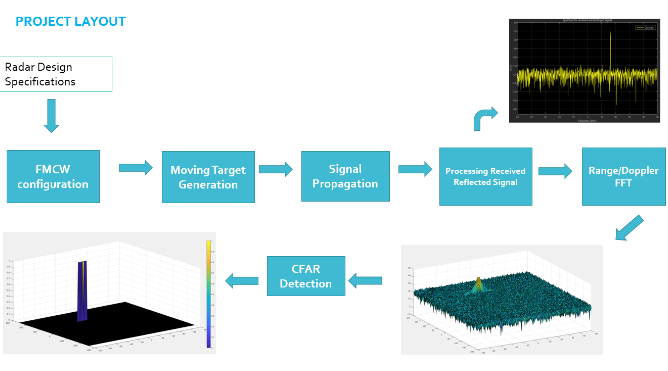
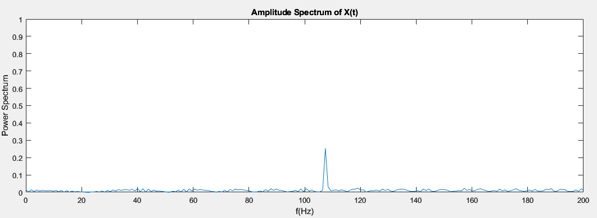
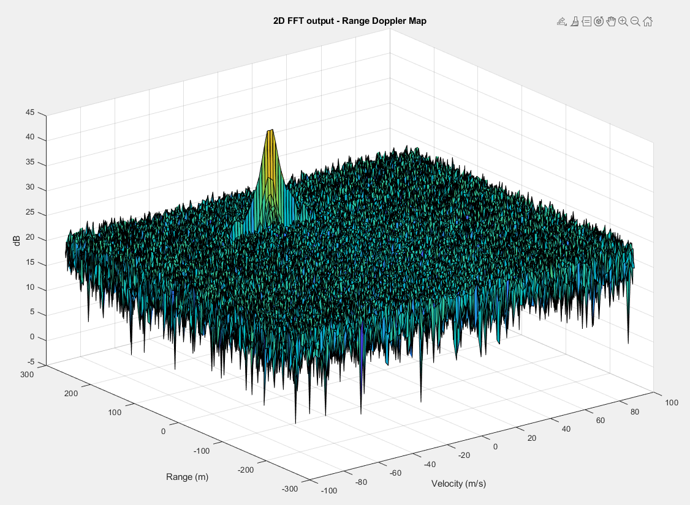
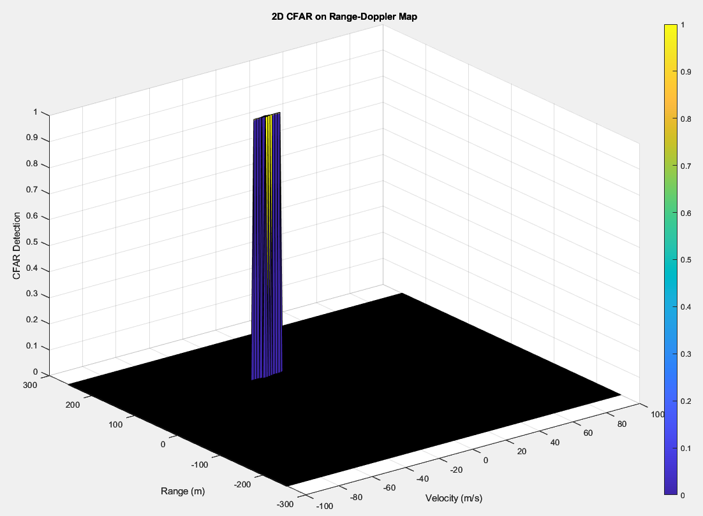

# Radar_Project

## System requierments

```Matlab
max_range = 200; % Radar's max range in m
range_res = 1;   % Radar's range resolution
max_velocity = 100; % Radar's max velocity
c = 3e8; % Speed of light (m/s)
R = 110; % Initial distance of the target
v = -20; % Speed of target
```

## FMCW Waveform Generation
```matlab
B = c / (2 * range_res);                   % Max - Min Freq in 1 chirp
Tchirp = 5.5 * 2 * max_range / c;          % Time taken for 1 chirp
slope = B / Tchirp;
```

## Signal generation and Moving Target simulation
```matlab
for i=1:length(t)         
    
    %TODO* :
    %For each time stamp update the Range of the Target for constant velocity. 
    ct = t(i);
    R = R + (Tchirp/Nr)*v;
    r_t(i) = R;

    %TODO* :
    %For each time sample we need update the transmitted and
    %received signal. 
    Tx(i) = cos (2*pi*(fc*ct +(slope*ct^2)/2));
    tt = 2 * R/c;
    td(i) = tt;
    Rx (i) = cos (2*pi*(fc*(ct-tt)+(slope*(ct-tt)^2)/2));
    
    %TODO* :
    %Now by mixing the Transmit and Receive generate the beat signal
    %This is done by element wise matrix multiplication of Transmit and
    %Receiver Signal
    Mix(i) = Tx(i) .* Rx (i);
    
end
```
#### Output



## RANGE DOPPLER RESPONSE

```matlab
% Range Doppler Map Generation.

% The output of the 2D FFT is an image that has reponse in the range and
% doppler FFT bins. So, it is important to convert the axis from bin sizes
% to range and doppler based on their Max values.

Mix=reshape(Mix,[Nr,Nd]);

% 2D FFT using the FFT size for both dimensions.
sig_fft2 = fft2(Mix,Nr,Nd);

% Taking just one side of signal from Range dimension.
sig_fft2 = sig_fft2(1:Nr/2,1:Nd);
sig_fft2 = fftshift (sig_fft2);
RDM = abs(sig_fft2);
RDM = 10*log10(RDM) ;

%use the surf function to plot the output of 2DFFT and to show axis in both
%dimensions
doppler_axis = linspace(-100,100,Nd);
range_axis = linspace(-200,200,Nr/2)*((Nr/2)/400);
figure,surf(doppler_axis,range_axis,RDM);

title('2D FFT output - Range Doppler Map')
xlabel('Velocity (m/s)')
ylabel('Range (m)')
zlabel('dB')
```
#### Output




## CFAR implementation

### Implementation steps for the 2D CFAR process.
```matlab
%TODO* :
% The process above will generate a thresholded block, which is smaller 
%than the Range Doppler Map as the CUT cannot be located at the edges of
%matrix. Hence,few cells will not be thresholded. To keep the map size same
% set those values to 0. 
range_size = 2 * (Tr + Gr) + 1;
doppler_size = 2 * (Td + Gd) + 1;
n_cells = range_size * doppler_size - (2 * Gr + 1) * (2 * Gd + 1);

cfar_signal = zeros(Nr/2, Nd); %inialize the grid area

for i = 1+Tr+Gr:(Nr/2 - (Gr+Tr))
    for j = 1+Td+Gd:(Nd - (Gd+Td))
        % For every iteration sum the signal level within all the training cells.
        % To sum convert the value from logarithmic to linear using db2pow function.
        sum_all_cells = sum(db2pow( RDM(i-(Tr+Gr):i+Tr+Gr, j-(Td+Gd):j+Td+Gd)) , 'all');
        sum_excl_cells_only  = sum(db2pow( RDM(i-Gr:i+Gr, j-Gd:j+Gd)) , 'all');
        noise_level = sum_cells - sum_excl_cells_only;

        % Average the summed values for all of the training cells used.
        % After averaging convert it back to logarithimic using pow2db.
        % Further add the offset to it to determine the threshold. 
        threshold = noise_level / n_cells;
        threshold = db2pow(pow2db(threshold) + offset);

        % Next, compare the signal under CUT with this threshold. 
        % If the CUT level > threshold assign it a value of 1, else equate it to 0.
        signal_cut =  db2pow(RDM( i,j ));
        if (signal_cut <= threshold)
            cfar_signal(i,j) = 0;
        else
            cfar_signal(i,j) = 1;
        end
    end
end

%TODO* :
%display the CFAR output using the Surf function like we did for Range
%Doppler Response output.
figure,surf(doppler_axis,range_axis, cfar_signal);
title("2D CFAR on Range-Doppler Map")
xlabel('Velocity (m/s)')
ylabel('Range (m)')
zlabel('CFAR Detection')
colorbar;
```
#### Output




### Selection of Training, Guard cells and offset.
- Selected the Training Cells and dimensions to be 6
- Selected the Training Guard cells and dimensions to be 3
- Selected the Threshold offset to be 5

```matlab
%TODO* :
%Select the number of Training Cells in both the dimensions.
Tr = 6;        % Training Cells in range dimension
Td = 6;         % Training Cells in doppler dimension

%TODO* :
%Select the number of Guard Cells in both dimensions around the Cell under 
%test (CUT) for accurate estimation
Gr = 3;
Gd = 3;

%TODO* :
% offset the threshold by SNR value in dB
offset = 5;

```
### Steps taken to suppress the non-thresholded cells at the edges.
I used this equation to find the grid cells taken into the consideration the presence of Target and Guard cells

```matlab
range_size = 2 * (Tr + Gr) + 1;
doppler_size = 2 * (Td + Gd) + 1;
n_cells = range_size * doppler_size - (2 * Gr + 1) * (2 * Gd + 1);
```
